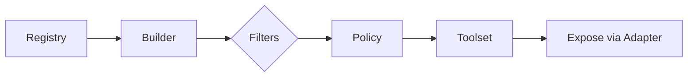

# PRD-001: toolset Composition Library Implementation

> **For agents:** REQUIRED SUB-SKILL: Use superpowers:executing-plans to implement this plan task-by-task.

**Goal:** Create a composable tool collection library that enables curated, filtered, and access-controlled tool sets from multiple sources.

**Architecture:** Fluent builder pattern for constructing toolsets from registries, with filtering by namespace, tags, categories, and custom policies. Supports multiple exposure formats (MCP, OpenAI, Anthropic) via `tooladapter`.

**Tech Stack:** Go 1.24+, `tooladapter` dependency, `toolindex` dependency (optional integration)

**Priority:** P1

---

## Context and Stack Alignment

The existing stack provides:
- `toolmodel` (canonical MCP tool schema)
- `toolindex` (registry + discovery)
- `toolrun` (execution)
- `tooldocs` (progressive disclosure)

`toolset` is the composition layer that builds curated collections of tools for specific audiences or capabilities. It should be independent of execution and transport. It consumes canonical tools (from `tooladapter`) and can optionally bridge from `toolindex`.

---

## Scope

### In scope
- Toolset core type with add/get/remove/filter operations.
- Builder pattern for assembling toolsets from registries or explicit lists.
- Filter helpers: namespace, tags, categories, explicit allow/deny lists.
- Policy interface for access control decisions.
- Exposure helpers for exporting to MCP/OpenAI/Anthropic via `tooladapter` adapters.
- Unit tests for all exported behavior.
- Minimal README + package doc.

### Out of scope (future)
- Persistence, versioning, or live sync.
- Runtime execution or tool invocation.
- Multi-tenant enforcement (handled later).

---

## Design Principles

1) **Deterministic output**: tool listing and exposures are stable across runs.
2) **No side effects**: no I/O, no network, no execution.
3) **Composability first**: use small, reusable filters and policies.
4) **Non-destructive filtering**: original toolset is never mutated by filters.
5) **Minimal dependencies**: keep this module lightweight.

---

## Directory Structure

```
toolset/
├── toolset.go
├── toolset_test.go
├── builder.go
├── builder_test.go
├── filter.go
├── filter_test.go
├── policy.go
├── policy_test.go
├── exposure.go
├── exposure_test.go
├── doc.go
├── README.md
├── go.mod
└── go.sum
```

---

## API Shape (Conceptual)

```go
// Toolset is a thread-safe collection of tools.
type Toolset struct {
    Name() string
    Add(tool *tooladapter.CanonicalTool)
    Get(id string) (*tooladapter.CanonicalTool, bool)
    Remove(id string) bool
    Tools() []*tooladapter.CanonicalTool
    IDs() []string
    Count() int
    Filter(fn FilterFunc) *Toolset
}

// Builder constructs toolsets from registries or tool slices.
type Builder struct {
    FromRegistry(r Registry) *Builder
    FromTools(tools []*tooladapter.CanonicalTool) *Builder
    WithNamespace(ns string) *Builder
    WithNamespaces(ns []string) *Builder
    WithTags(tags []string) *Builder
    WithCategories(categories []string) *Builder
    WithTools(ids []string) *Builder
    ExcludeTools(ids []string) *Builder
    WithPolicy(p Policy) *Builder
    Build() (*Toolset, error)
}

// Filter helpers
// - NamespaceFilter(ns)
// - TagsAnyFilter(tags)
// - TagsAllFilter(tags)
// - CategoryFilter(categories)
// - AllowIDs(ids)
// - DenyIDs(ids)

// Policy decides whether to include a tool.
type Policy interface {
    Allow(tool *tooladapter.CanonicalTool) bool
}

// Exposure exports to protocol-specific tool shapes via adapters.
type Exposure struct {
    Export(adapter tooladapter.Adapter) ([]any, []tooladapter.FeatureLossWarning)
}
```

---

## Requirements

### R1 — Toolset operations
- Thread-safe add/get/remove.
- Stable `IDs()` and `Tools()` ordering (lexicographic by tool ID).
- Filter returns a new toolset without mutating original.

### R2 — Builder
- Build toolsets from:
  - Registry (adapter or index-based)
  - Explicit tool list
- Fluent filters: namespace(s), tags, categories, include/exclude list.
- Filters are AND-composed in builder chain.

### R3 — Filters
- Tags filter supports two semantics:
  - `TagsAny`: tool matches if it contains any tag.
  - `TagsAll`: tool matches only if it contains all tags.
- Namespace and category filters are exact-match unless documented.

### R4 — Policy
- Policy interface can deny tools based on metadata (namespace, tags, source, scopes).
- Builder applies policy last (after other filters), so policy can enforce hard denials.

### R5 — Exposure
- Export to MCP/OpenAI/Anthropic via `tooladapter` adapters.
- Return warnings for feature loss; never drop silently.
- Exposure must not mutate underlying toolset or canonical tools.

### R6 — Concurrency & safety
- Toolset operations must be safe under concurrent access.
- Builder is not required to be concurrency-safe.

### R7 — Tests
- TDD: failing tests first.
- Coverage target >80% for the module.

---

## Integration Notes

- Optional `toolindex` integration should be thin:
  - Wrap `toolindex.Index` and use `tooladapter` MCP adapter to convert `toolmodel.Tool` -> `CanonicalTool`.
  - Avoid direct coupling to `toolrun` or `tooldocs`.
- `toolset` should remain usable without `toolindex` (pure in-memory tool slice).

---

## Acceptance Criteria

- Toolset core + builder + filters + policy + exposure implemented.
- MCP/OpenAI/Anthropic exposure works via `tooladapter`.
- Deterministic ordering in `Tools()` and exposure outputs.
- All tests pass with >80% coverage.
- Documentation (`doc.go`, README) present and accurate.

---

## Dependencies

- `github.com/jonwraymond/tooladapter` (protocol adapters)
- `github.com/jonwraymond/toolindex` (optional registry integration)

---

## Versioning, Propagation, and Release Train Integration

### Source of truth
- `ai-tools-stack/go.mod` is the authoritative version matrix for the stack.
- `ai-tools-stack/VERSIONS.md` is auto-generated and synced into each repo.

### Propagation sequence (new module)
1) **Tag `toolset`** with `vX.Y.Z` once tests + docs are green.
2) **Update `ai-tools-stack/go.mod`** to include `toolset` at the tagged version.
3) **Run** `ai-tools-stack/scripts/update-version-matrix.sh --apply` to regenerate and sync `VERSIONS.md` across repos.
4) **Update docs site** (see Docs section) so `toolset` appears in Components + Library Docs.

### DAG order impact
`toolset` depends on `tooladapter` and optionally `toolindex`, so DAG order becomes:

```
toolmodel → tooladapter → toolset → (future: toolskill, toolsemantic, metatools-mcp wiring)
```

This ordering must be respected for release bumps.

### Tagging conventions
- Go module tags: `vX.Y.Z`
- Optional release tags: `toolset-vX.Y.Z` (if used elsewhere in the stack)

---

## Integration with metatools-mcp

`toolset` is the natural layer for **curated exposure** of tools. Integration expectations:

1) `toolindex` continues to store canonical MCP tools for discovery.
2) `tooladapter` can normalize `toolmodel.Tool` into `CanonicalTool` via MCP adapter.
3) `toolset` builds filtered collections (namespace/tags/policy) from those canonical tools.
4) `metatools-mcp` can later add optional wiring to expose only a `toolset` subset.

This PRD does **not** change server behavior, but the APIs must allow a clean hook
for future metatools configuration (for example, `providers.exposure=toolset`).

---

## Documentation, Diagrams, and Publishing

### Repo docs (toolset)
Create detailed docs under `toolset/docs/`:
- `docs/index.md` — overview + quickstart + builder usage
- `docs/design-notes.md` — filter semantics, policy order, deterministic output
- `docs/user-journey.md` — example: build MCP-only safe toolset

Include **Mermaid** diagrams for builder flow and exposure, e.g.:



### Stack docs (ai-tools-stack)
Add or update:
- `ai-tools-stack/docs/components/toolset.md`
- `ai-tools-stack/mkdocs.yml`:
  - Add `toolset` under **Components**
  - Add `toolset` under **Library Docs (from repos)** with multirepo import
- If needed, update `ai-tools-stack/docs/operations/ci-and-versioning.md` to mention the new module in the version matrix narrative.

**Docs system review (how it works):**
- `ai-tools-stack/mkdocs.yml` uses the **multirepo plugin** to import `docs/` from each repo via `!import`.
- Local preview requires:
  ```bash
  cd ai-tools-stack
  ./scripts/prepare-mkdocs-multirepo.sh
  mkdocs serve
  ```
- Versioned docs are published via **mike**:
  - `latest` tracks `main`
  - tags publish versioned docs and set `stable`

**Docs inventory (where to update):**
- `ai-tools-stack/docs/index.md` — high-level stack landing
- `ai-tools-stack/docs/components/*.md` — per-repo component summaries
- `ai-tools-stack/docs/architecture/overview.md` — stack diagrams (SVG from D2)
- `ai-tools-stack/docs/operations/ci-and-versioning.md` — version matrix + release workflow
- `ai-tools-stack/docs/operations/stack-changelog.md` — generated from `ai-tools-stack/go.mod`

### D2 component diagram
Create `ai-tools-stack/docs/diagrams/component-toolset.d2` and render to SVG:

```bash
cd ai-tools-stack
./scripts/render-d2.sh
```

Reference the SVG in `ai-tools-stack/docs/components/toolset.md` and, if needed,
in `docs/architecture/overview.md`.

### Publishing flow (GitHub Pages + MkDocs)
- MkDocs site builds via `ai-tools-stack` CI with multirepo plugin.
- Docs from `toolset/docs/` are pulled automatically by `!import` entries.
- Versioned docs are published with `mike`; `latest` tracks `main` and tags publish stable versions.

---

## Quality Gates

- `go test ./...`
- `go vet ./...`
- `golangci-lint run` (if configured)
- `gosec ./...` (if configured)

Never claim checks passed unless actually run.

---

## Release & Versioning

- Use semver tags (`vX.Y.Z`).
- Add `VERSIONS.md` once aligned with `ai-tools-stack` version matrix.
- After tagging, update `ai-tools-stack/go.mod` + `ai-tools-stack/VERSIONS.md`.

---

## Notes

- Avoid UTCP terminology. MCP terminology only.
- Do not leak adapter-specific types outside exposure functions.
- Keep filtering fast; avoid O(n^2) scans for repeated operations.
