# User Journey: Curated Toolset Exposure

This walkthrough shows how to build a safe MCP-only toolset and export it for use
by an MCP server or other consumer.

## Scenario

You have a large tool registry but want to expose **only safe, read-only tools**
from the `mcp` namespace. You also want a single export step that can later be
adapted to OpenAI or Anthropic formats.

## Step 1: Define canonical tools

```go
import "github.com/jonwraymond/tooladapter"

all := []*tooladapter.CanonicalTool{
    {
        Namespace:   "mcp",
        Name:        "search",
        Tags:        []string{"read", "safe"},
        Description: "Search resources",
        InputSchema: &tooladapter.JSONSchema{Type: "object"},
    },
    {
        Namespace:   "mcp",
        Name:        "execute",
        Tags:        []string{"write", "danger"},
        Description: "Execute a command",
        InputSchema: &tooladapter.JSONSchema{Type: "object"},
    },
}
```

## Step 2: Build a filtered toolset

```go
import "github.com/jonwraymond/toolset"

safe, err := toolset.NewBuilder("mcp-safe").
    FromTools(all).
    WithNamespace("mcp").
    WithTags([]string{"safe"}).
    ExcludeTools([]string{"mcp:execute"}).
    Build()
```

At this point, `safe` contains only the `mcp:search` tool.

## Step 3: Export for MCP usage

```go
import "github.com/jonwraymond/tooladapter/adapters"

exposure := toolset.NewExposure(safe, adapters.NewMCPAdapter())
exports, warnings, errs := exposure.ExportWithWarnings()
if len(errs) > 0 {
    // handle conversion errors (tool IDs included)
}
```

If the tools used unsupported schema features, you would see warnings here. If a
tool fails conversion, it will be omitted from `exports` and reported in `errs`.

## Flow Diagram

```mermaid
%%{init: {'theme': 'base', 'themeVariables': {'primaryColor': '#3182ce'}}}%%
flowchart LR
    subgraph input["Input"]
        A["📦 Canonical Tools"]
    end

    subgraph building["Building"]
        B["🔨 Builder"]
        C{"🔍 Filters<br/><small>Namespace, Tags,<br/>IDs, Categories</small>"}
        D["🔒 Policy<br/><small>Allow/Deny/Warn</small>"]
    end

    subgraph result["Result"]
        E["📦 Toolset<br/><small>Thread-safe</small>"]
    end

    subgraph export["Export"]
        F["🔄 Exposure"]
        G1["📡 MCP"]
        G2["🤖 OpenAI"]
        G3["🔷 Anthropic"]
    end

    A --> B --> C --> D --> E
    E --> F
    F --> G1
    F --> G2
    F --> G3

    style input fill:#718096,stroke:#4a5568
    style building fill:#3182ce,stroke:#2c5282
    style result fill:#38a169,stroke:#276749
    style export fill:#d69e2e,stroke:#b7791f
```



## Composition Pipeline

```mermaid
%%{init: {'theme': 'base', 'themeVariables': {'primaryColor': '#6b46c1'}}}%%
flowchart TD
    subgraph sources["Tool Sources"]
        All["📦 All Canonical Tools<br/><small>from tooladapter</small>"]
    end

    subgraph builder["toolset.Builder Chain"]
        B1["FromTools(all)"]
        B2["WithNamespace('mcp')"]
        B3["WithTags(['safe'])"]
        B4["ExcludeTools(['mcp:execute'])"]
        B5["WithPolicy(readOnlyPolicy)"]
        Build["Build()"]
    end

    subgraph output["Output"]
        Safe["📦 Safe Toolset<br/><small>Only mcp:search</small>"]
    end

    All --> B1 --> B2 --> B3 --> B4 --> B5 --> Build --> Safe

    style sources fill:#718096,stroke:#4a5568
    style builder fill:#6b46c1,stroke:#553c9a
    style output fill:#38a169,stroke:#276749
```



## Notes

- Filters are AND-composed.
- Policies run last and can hard-deny tools.
- Exposure never mutates the underlying Toolset.
